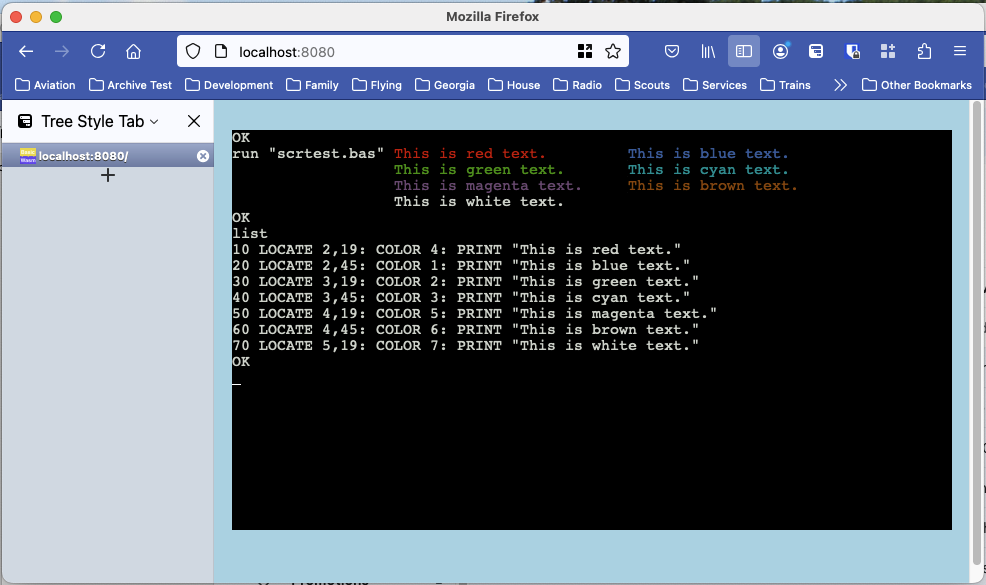

# basicwasm
The beginning of a gwbasic runtime that compiles to web assembly.  Let's see how this works out.

So, why am I doing this?  Get ready for a long story.

First, I blame Thorsten Ball.  Thorsten wrote two incredible books, *Writing an Interpreter in Go* followed by *Writing a Compiler in Go*.  I started reading the interpreter book and writing the sample interpreter described in the book.  I had been using Go for about five years so I was really able to focus core problem.  Big fun!

Then one day I got to thinking about another project I had started but had never been able to figure out a good way to complete.  The project came about when I found a collection of utilities written to help amateur radio enthusiasts perform all sorts of calculations.  How to calculate signal velocity in various kinds of coax, calculate the inductance of a coil, how to design a loop antenna...

In all, more then 400 different utilities that had been carefully collected, written and combined into a menu driven set of programs that allowed easy access to a wealth of RF engineering knowledge.  All of it pulled together and maintained by **Mark Ellison**, callsign **VE3ERP**.  Mark had decided to stop trying to maintain the software a few years earlier and had made arrangements with CQ magazine to make it available via their website. [Here](https://www.cq-amateur-radio.com/cq_ham_calc/cq_ham_calc.html) 

There was only one problem, it was written in a language called *GWBasic*.  A language from Microsoft for the original PC, but no longer supported by Microsoft.  There are interpreters available that can be installed on most of the current operating systems that will allow you to run basic programs.  But it occurred to me, *"That isn't really how people like to consume software."*  It would be better to make all the utilities into web pages you could access via your browser.

But that was going to take a lot of **very repetitive** coding.  Isn't that what computers are best at?

That is when I decided that instead of writing an interpreter for Monkey, a fine language in its own right, but not really useful for me.  I was going to write an interpreter for basic.  Specifically, GWBasic.  An interpreter that compiled down to web assembly so it can run in your browser.

At this point, only a small portion of the language is supported.  I have included an Excel spreadsheet that I am filling to show which language elements have been implemented and any limitations of the implementation.

# basicwasm running in the browser



### Building from source

Prerequestives: Golang build toolkit, `make`, `npm`.

```sh
git clone https://github.com/navionguy/basicwasm
cd basicwasm
npm install --prefix=$HOME xterm xterm-addon-fit

make basicwasm
```

#### Testing GUI in browser

Start simple HTTP server to serve content from `assets` directory:

```sh
cp assets/html/gwbasic.html assets/index.html
python3 -m http.server --directory assets
```
